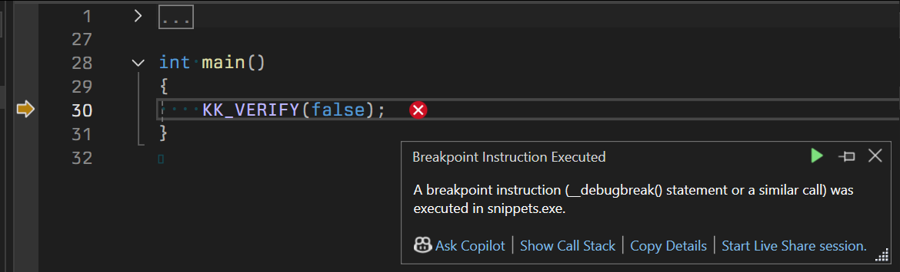

-----------------------------------------------------------

### meta {.unnumbered .unlisted #meta}

To generate this .html out of [cpp_tips_tricks_quirks.md], run [Pandoc](https://pandoc.org/):

```
pandoc -s --toc --toc-depth=4
  --standalone
  --number-sections
  --highlight=kate
  --from markdown --to=html5
  --lua-filter=anchor-links.lua
  cpp_tips_tricks_quirks.md
  -o cpp_tips_tricks_quirks.html
```

where [anchor-links.lua] is the only customization for # links in sections.

[cpp_tips_tricks_quirks.md]: https://raw.githubusercontent.com/grishavanika/grishavanika.github.io/refs/heads/master/cpp_tips_tricks_quirks.md
[anchor-links.lua]: https://raw.githubusercontent.com/grishavanika/grishavanika.github.io/refs/heads/master/anchor-links.lua

[C++ reference]{.mark}:

 * [Working Draft/eel.is](https://eel.is/c++draft)
 * [cppreference](https://en.cppreference.com/w/), [compiler support](https://en.cppreference.com/w/cpp/compiler_support)
 * [WG21 redirect service/wg21.link](https://wg21.link/)
 * [Compiler Explorer/godbolt](https://godbolt.org/)
 * [Cpp Insights](https://cppinsights.io/)

-----------------------------------------------------------

### accidental pair copy {#1}

Here, `kv` is a COPY instead of const reference since std::meow_map `value_type`
is `std::pair<const Key, T>`, notice **const Key**.

``` cpp {.numberLines}
// wrong
for (const std::pair<std::string, int>& kv : my_map)
    // ...
```

`pair<std::string, int>` is copy-constructed from `pair<const std::string, int>`
. Proper version:

``` cpp {.numberLines}
// correct
for (const std::pair<const std::string, int>& kv : my_map)
    // ...
```

Note, [AAA style (Almost Always Auto)](https://herbsutter.com/2013/08/12/gotw-94-solution-aaa-style-almost-always-auto/)
recommends to go with `const auto&` that also solves the problem
(sadly, with the loss of explicitly written types):

``` cpp {.numberLines}
// correct
for (const auto& kv : my_map)
    // ...
```

with C++17 structured binding, it's also:

``` cpp {.numberLines}
// correct
for (const auto& [key, value] : my_map)
    // ...
```

See [/u/STL](https://www.reddit.com/user/STL/) [comments](https://www.reddit.com/r/cpp/comments/1fhncm2/comment/lndnk8m/).
Note on /u/STL [meow](https://brevzin.github.io/c++/2023/03/14/prefer-views-meow/).

### declare function with typedef/using {#2}

Surprisingly, you can declare a function with using declaration:

``` cpp {.numberLines}
using MyFunction = void (int);

// same as `void Foo(int)`. NOT a variable
MyFunction Foo;

// actual definition
void Foo(int)
{
}
```

Notice, Foo is **not** a variable, but function declaration.
Running the code above with `clang -Xclang -ast-dump`, shows:

``` {.numberLines}
`-FunctionDecl 0xcc10e50 <line:4:1, col:12> col:12 Foo 'MyFunction':'void (int)'
  `-ParmVarDecl 0xcc10f10 <col:12> col:12 implicit 'int'
```

Same can be done to declare a method:

``` cpp {.numberLines}
struct MyClass
{
    using MyMethod = void (int, char);
    // member function declaration
    MyMethod Bar;
    // equivalent too:
    // void Bar(int);
};

// actual definition
void MyClass::Bar(int)
{
}
```

Mentioned at least [there](https://www.reddit.com/r/C_Programming/comments/2pkwvf/comment/cmxlx0e).
See also:

``` cpp {.numberLines}
typedef double MyFunction(int, double, float);
MyFunction foo, bar, baz; // functions declarations
// OR
int foo(char), bar();
```

### protected/private virtual functions override {#3}

Access rights are resolved at compile-time, virtual function target - at
run-time. It's perfectly fine to move virtual-override to private section:

``` cpp {.numberLines}
class MyBase
{
public:
    virtual void Foo(int) {}
    // ...
};

class MyDerived : public MyBase
{
private:
    // note: Foo is private now
    virtual void Foo(int v) override {}
};

void Use(const MyBase& base)
{
    base.Foo(42); // calls override, if any
}

Use(MyDerived{});
```

It (a) clean-ups derived classes public API/interface (b) explicitly signals
that function is expected to be invoked from within framework/base class and 
(c) does not break Liskov substitution principle.

In heavy OOP frameworks that rely on inheritance (Unreal Engine, as an example),
it makes sense to make virtual-overrides protected instead of private so derived
class could invoke Super:: version in the implementation.


### function try block {#4}

See [cppreference](https://en.cppreference.com/w/cpp/language/try#Function_try_block).
Specifically, to handle exceptions for constructor initializer:

``` cpp {.numberLines}
int Bar()
{
    throw 42;
}

struct MyFoo
{
    int data;
 
    MyFoo() try : data(Bar()) {}
    catch (...)
    {
        // handles the exception
    }
};
```

but also works just fine for regular functions to handle arguments construction
exceptions:

``` cpp {.numberLines}
void Foo(std::string) try
{
    // function body
}
catch (...)
{
    // exception handling for arguments
}
```

### omiting `public` when deriving {#5}

Minor, still, see [cppreference, access-specifier](https://en.cppreference.com/w/cpp/language/derived_class):

``` cpp {.numberLines}
struct MyBase {};
struct MyDerived1 : MyBase {}; // same as : public  MyBase
class  MyDerived2 : MyBase {}; // same as : private MyBase
```

### `(void)0` to force `;` (semicolon) for macros {#6}

To be consistent and force the user of the macro to put `;` (semicolon)
at the line end:

``` cpp {.numberLines}
#define MY_FOO(MY_INPUT) \
    while (true) {       \
        MY_INPUT;        \
        break;           \
    } (void)0
    // ^^^^^^
MY_FOO(puts("X"));
MY_FOO(puts("Y"));
```

### call a method of a template base class {#7}

See also [Accessing template base class members in C++](https://yunmingzhang.wordpress.com/2019/01/26/accessing-template-base-class-members-in-c/).

Given standard code like this:

``` cpp {.numberLines}
struct MyBase { void Foo(); };
struct MyDerived : MyBase
{
    void Bar() { Foo(); }
};
```

we can call `Base::Foo()` with no issues. However, in case when we use
templates, Foo() can't be found. The trick is to use `this->Foo()`.
Or `MyBase<U>::Foo()`:

``` cpp {.numberLines}
template<typename T>
struct MyBase { void Foo(); };
template<typename U>
struct MyDerived : MyBase<U>
{
    void Bar() { this->Foo(); }
};
```

`this->Foo()` becomes [type-dependent expression](https://en.cppreference.com/w/cpp/language/dependent_name).

### `= default` on implementation {#8}

You can default special member functions in the .cpp/out of line definition:

``` cpp {.numberLines}
struct MyClass
{
    MyClass();
};
// myclass.cpp, for instance:
MyClass::MyClass() = default;
```

Note, this is almost the same as = default in-place, but makes constructor
user-defined. Sometimes it's not a desired side effect. However, it's nice
in case you want to change the body of constructor later or put breakpoint
(since you don't need to change header and recompile dependencies,
only .cpp file).

Another use-case is to move destructor to .cpp file so you don't delete
incomplete types:

``` cpp {.numberLines}
struct MyInterface; // forward-declare
struct MyClass
{
    std::unique_ptr<MyInterface> my_ptr;
    ~MyClass();
};
// myclass.cpp
#include "MyInterface.h" // include only now
MyClass::~MyClass() = default; // generate a call to my_ptr.~unique_ptr()
```

### `= delete` for free functions {#9}

You can delete unneeded function overload anywhere:

``` cpp {.numberLines}
void MyHandle(char) = delete;
void MyHandle(int);
```

`MyHandle('x')` does not compile now, see [std::ref](https://en.cppreference.com/w/cpp/utility/functional/ref), [std::as_const](https://en.cppreference.com/w/cpp/utility/as_const)
for the use in STL.

### `#line` and file renaming {#10}

See [cppreference](https://en.cppreference.com/w/c/preprocessor/line):

``` cpp {.numberLines}
// main.cpp
#include <assert.h>
int main()
{
#line 777 "any_filename.x"
    assert(false);
}
```

wich outputs:

> output.s: any_filename.x:777: int main(): Assertion `false` failed.

Note: this could break .pdb(s).  
Bonus: what happens if you do `#line 4294967295`?

### Meyers cons_cast {#11}

To not repeat code inside const and non-const function, [see SO](https://stackoverflow.com/a/123995):

``` cpp {.numberLines}
struct MyArray
{
    char data[4]{};

    const char& get(unsigned i) const
    {
        assert(i < 4);
        return data[i];
    }
    char& get(unsigned i)
    {
        return const_cast<char&>(static_cast<const MyArray&>(*this).get(i));
    }
};
```

Note: mutable `get()` is implemented in terms of const version, not the other
way around (which would be UB).

Kind-a outdated with [C++23's Deducing this](https://devblogs.microsoft.com/cppblog/cpp23-deducing-this/)
or is it? (template, compile time, .h vs .cpp).

### missing `std::` and why it still compiles (ADL) {#12}

Notice, that code below will compile (most of the time):

``` cpp {.numberLines}
std::vector<int> vs{6, 5, 4, 3, 2, 1};
sort(vs.begin(), vs.end()); // note: missing std:: when calling sort()
```

Since std::vector iterator lives in namespace `std::` (\*), ADL will be
performed to find std::sort and use it. ADL = [Argument-dependent lookup (ADL),
also known as Koenig lookup](https://en.cppreference.com/w/cpp/language/adl).

(\*) Note, iterator could be just raw pointer (`int*`) and it's implementation
defined (?) where or not iterator is inside std. Meaning the code above
is not portable (across different implementations of STL).

### why STL is using `::std::move` everywhere? {#13}

Take a look at [MSVC's implementation of the C++ Standard Library](https://github.com/microsoft/STL/blob/faccf0084ed9b8b58df103358174537233b178c7/stl/inc/algorithm#L452-L453):

``` cpp {.numberLines startFrom="452"}
_STD _Seek_wrapped(_First, _STD move(_UResult.in));
return {_STD move(_First), _STD move(_UResult.fun)};
```

\_STD is `#define _STD ::std::`. Why?  

So `::std::move` is used to **disable** ADL and make sure
implementation of `move` from namespace `std` is choosen.
Who knows what user-defined custom type could bring into the table?

### the use of shared_ptr in public API is a code smell {#14}

[TBD]{.mark}

### enable_shared_from_this requires factory function {#15}

If class derives from `enable_shared_from_this`:

 * most likely, objects are required to be created with shared_ptr and
 * the use of `shared_from_this()` in constructor is not safe anyway.

Hence, provide `Create()` factory function to encode the behavior:

``` cpp {.numberLines}
struct MyData : public std::enable_shared_from_this<MyData>
{
public:
    static std::shared_ptr<MyData> Create()
    {
        // Quiz: why not std::make_shared?
        return std::shared_ptr<MyData>(new MyData{});
    }

private:
    explicit MyData() = default;
};
```

See [cppreference example](https://en.cppreference.com/w/cpp/memory/enable_shared_from_this#Example).
Most-likely, you also want class copy/move ctor/assignments to be deleted.

### `std::shared_ptr` aliasing constructor {#16}

See [aliasing constructor](https://en.cppreference.com/w/cpp/memory/shared_ptr/shared_ptr):

``` cpp {.numberLines}
struct MyType
{
    int data;
};

std::shared_ptr<MyType> v1 = std::make_shared<MyType>();
std::shared_ptr<int> v2{v1, &v1->data};
```

v2 and v1 now share the same control block.
You can also put a pointer to unrelative data (is there real-life use-case?).

### `dynamic_cast<void*>` to get most-derived object {#17}

From anywhere in the hierarhy of polimorphic type, you can restore a pointer
to most-derived instance (i.e., the one created by `new` initially):

``` cpp {.numberLines}
struct MyBase { virtual ~MyBase() = default; };
struct MyDerived : MyBase {};

MyDerived* original_ptr = new MyDerived{};

MyBase* base_ptr = original_ptr;
void* void_ptr = dynamic_cast<void*>(base_ptr);

assert(void_ptr == original_ptr);
```

See [cppreference](https://en.cppreference.com/w/cpp/language/dynamic_cast).
Most-likely useful to interop with C library/external code.

### `std::shared_ptr<base>` with no virtual destructor {#18}

Usually, if you delete pointer-to-base, destructor needs to be declared virtual
so proper destructor is invoked. Hovewer, for std::shared_ptr this is not
required:

``` cpp {.numberLines}
struct MyBase { ~MyBase(); }; // no virtual!
struct MyDerived : MyBase
{
    ~MyDerived() { std::puts("~MyDerived()"); }
};

{
    std::shared_ptr<MyBase> ptr = std::make_shared<MyDerived>();    
} // invokes ~MyDerived()
```

`std::shared_ptr<MyBase>` holds `MyBase*` pointer, but has [type-erased](https://en.wikibooks.org/wiki/More_C%2B%2B_Idioms/Type_Erasure)
destroy function that remembers the actual type it was created with.

See also [GotW #5, Overriding Virtual Functions](http://www.gotw.ca/gotw/005.htm):

> Make base class destructors virtual

### stateful metaprogramming / type loophole {#19}

This [works](https://b.atch.se/posts/constexpr-counter/) and a and b
have different values:

``` cpp {.numberLines}
int main () {
  constexpr int a = f();
  constexpr int b = f();

  static_assert(a != b);
}
```

See, for instance, [Revisiting Stateful Metaprogramming in C++20](https://mc-deltat.github.io/articles/stateful-metaprogramming-cpp20):

 * [constant-expression counter](https://b.atch.se/posts/constexpr-counter/)
 * [compile-time list](https://b.atch.se/posts/constexpr-meta-container/)
 * [nonconstant constant expressions](https://b.atch.se/posts/non-constant-constant-expressions/)
 * [stateful metaprogramming via friend injection](https://www.open-std.org/jtc1/sc22/wg21/docs/cwg%5Factive.html#2118)
 * [hack C++ with templates and friends](https://www.worldcadaccess.com/blog/2020/05/how-to-hack-c-with-templates-and-friends.html)
 * [The C++ Type Loophole](https://alexpolt.github.io/type-loophole.html)

### access private members (via friend injection) {#20}

Self-contained example from [How to Hack C++ with Templates and Friends](https://www.worldcadaccess.com/blog/2020/05/how-to-hack-c-with-templates-and-friends.html):

``` cpp {.numberLines}
template<int Private::* Member>
struct Stealer {
  friend int& dataGetter(Private& iObj) {
    return iObj.*Member;
  }
};

template struct Stealer<&Private::data>;
int& dataGetter(Private&);  //redeclare in global ns

// ...
Private obj;
dataGetter(obj) = 31;   // Ok
```

See [this](https://github.com/martong/access_private) for more details.


### extern templates {#21}

See, [this](https://isocpp.org/wiki/faq/cpp11-language-templates#extern-templates)
or [cppreference](https://en.cppreference.com/w/cpp/language/class_template).

Allows to declare some set of template instantiations and actually intantiate
them in another place. Usually, you extern template in the header and
instantiate in **your own**/library .cpp file:

``` cpp {.numberLines}
// myvector.h
template<typename T>
class MyVector { /**/ };

// declare frequently used instantiations
extern template class MyVector<int>;
extern template class MyVector<float>;
extern template class MyVector<char>;

// myvector.cpp
#include "myvector.h"

// instantiate frequent cases **once**;
// client needs to link with myvector.o
template class MyVector<int>;
template class MyVector<float>;
template class MyVector<char>;
```

C++ had also never implemeted C++98 [export keyword](https://en.cppreference.com/w/cpp/keyword/export)
(C++98, nothing to do with [modules](https://en.cppreference.com/w/cpp/language/modules)).

### templates in .cpp file {#22}

It's usually stated that templates could only be defined in header file.
However, you just need to define them anywhere so definition is visible at the
point of use/instantiation.

For intance, this works just fine:

``` cpp {.numberLines}
// myclass.h
class MyClass
{
public:
    int Foo();

private:
    template<typename T>
    int Bar();
};

// myclass.cpp
// template class, defined in this .cpp file
template<typename U>
struct MyHelper {};

template<typename T>
int MyClass::Bar()
{
    // definition of member-function-template Bar();
    // also, the use of MyHelper template above,
    // visible only to this transtlation unit
    return sizeof(MyHelper<T>{});
}

int MyClass::Foo()
{
    // use of function template
    return Bar<char>();
}
```

See also [extern templates](#21).

### double-template syntax {#23}

If you have template class that has template member function
and you want to define such function out-of-class, you need:

``` cpp {.numberLines}
template<typename T1, typename T2>
class MyClass
{
    template<typename U>
    void Foo(U v);
};

template<typename T1, typename T2>  // for MyClass
template<typename U>                // for Foo
void MyClass<T1, T2>::Foo(U v) {}
```

### when type T is bitcopyable? {#24}

When implementors do use memcopy/memmove to construct/assign range of values
for some user-defined type T? Use `std::is_trivially_*` [type traits](https://en.cppreference.com/w/cpp/meta)
to query the property:

``` cpp {.numberLines}
struct MyType
{
    int data = -1;
    char str[4]{};
};

int main()
{
    MyType v1{42};
    MyType v2{66};

    static_assert(std::is_trivially_copy_assignable<MyType>{});
    std::memcpy(&v1, &v2, sizeof(v1)); // fine
    assert(v1.data == 66);
}
```

Overall, see also [std::uninitialized_*](https://en.cppreference.com/w/cpp/memory/uninitialized_copy)
memory management and [std::copy algorithm](https://en.cppreference.com/w/cpp/algorithm/copy)
and/or analogs that are already optimized for trivial/pod types
by your standard library implementation for you.

### pseudo destructors (~int) {#25}

In generic context, it's possible to invoke the destructor of int:

``` cpp {.numberLines}
using MyInt = int;
MyInt v = 86;
v.~MyInt();
```

which is no-op. See [destructor](https://en.cppreference.com/w/cpp/language/destructor#Notes)
and [built-in member access operators](https://en.cppreference.com/w/cpp/language/operator_member_access#Built-in_member_access_operators).
Exists so you don't need to special-case destructor call in
generic/template code.

### manually invoke constructor {#26}

In the same way you can call destructor manually, you can call constructor:

``` cpp {.numberLines}
alignas(T) unsigned char buffer[sizeof(T)];
T* ptr = new(static_cast<void*>(buffer)) T; // call constructor
ptr->~T();                                  // call destructor
```

which is [placement new](https://en.cppreference.com/w/cpp/lanzguage/new#Placement_new).

Note on the use of `static_cast<void*>` - while not needed in this example, it's
needed to be done in generic context to avoid invoking overloaded version of
new, if any.

### injected-class-name {#27}

See [cppreference](https://en.cppreference.com/w/cpp/language/injected-class-name).
In short, every class has its own name inside the class itself. Which happens to
apply recursively. This leads to surprising syntax noone uses:

``` cpp {.numberLines}
struct MyClass
{
    int data = -1;
    void Foo();
};

int main()
{
    MyClass m;
    // access m.data
    m.MyClass::data = 4;
    assert(m.data == 4);
    // now with recursion
    m.MyClass::MyClass::MyClass::data = 7;
    assert(m.data == 7);
    // call a member function
    MyClass* ptr = &m;
    ptr->MyClass::Foo();
}
```

For templates, this allows to reference class type without specifying
template arguments.

``` cpp {.numberLines}
template<typename T, typename A>
struct MyVector
{
    // same as Self = MyVector<T, A>
    using Self = MyVector;
};
```

### invoke base virtual function directly {#28}

Given an instance of derived class, one can skip invoking its own function
override and call parent function directly (see [injected-class-name](#27)):

``` cpp {.numberLines}
struct MyBase
{
    virtual void Foo()
    { std::puts("MyBase"); }
};

struct MyDerived : MyBase
{
    virtual void Foo() override
    { std::puts("MyDerived"); }
};

int main()
{
    MyDerived derived;
    derived.MyBase::Foo();
    MyDerived* ptr = &derived;
    ptr->MyBase::Foo();
}
```

This will print `MyBase` 2 times since we explicitly call MyBase::Foo().

### perfect construct with factory function {#29}

See `class rvalue` trick discussed [there](https://akrzemi1.wordpress.com/2018/05/16/rvalues-redefined/);
see same trick discussed in [guaranteed copy elision in C++17](https://groups.google.com/a/isocpp.org/g/std-proposals/c/hQ654zTNyiM).

In short, we can return non-copyable/non-movable type from a function:

``` cpp {.numberLines}
struct Widget
{
    explicit Widget(int) {}
    Widget(const Widget&) = delete;
    Widget& operator=(const Widget&) = delete;
    Widget(Widget&&) = delete;
    Widget& operator=(Widget&&) = delete;
};

Widget MakeWidget()
{
    return Widget{68}; // works
}

int main()
{
    Widget w = MakeWidget(); // works
}
```

However, how to construct, let say `std::optional<Widget>`? That does not work:

``` cpp {.numberLines}
int main()
{
    std::optional<Widget> o1{MakeWidget()}; // does not compile
    std::optional<Widget> o2;
    o2.emplace(MakeWidget()); // does not compile
}
```

The trick is to use any type that has [implicit conversion operator](https://en.cppreference.com/w/cpp/language/cast_operator):

``` cpp {.numberLines}
struct WidgetFactory
{
    operator Widget()
    {
        return MakeWidget();
    }
};

int main()
{
    std::optional<Widget> o;
    o.emplace(WidgetFactory{}); // works
}
```

### disable template argument deduction {#30}

See, for instance, [What's the deal with std::type_identity?](https://devblogs.microsoft.com/oldnewthing/20240607-00/?p=109865)
or [dont_deduce\<T\>](https://artificial-mind.net/blog/2020/09/26/dont-deduce).
In short, this will not compile:

``` cpp {.numberLines}
template<typename T>
void Process(std::function<void (T)> f, T v)
{
    f(v);
}

int main()
{
    Process([](int) {}, 64);
}
```

We try to pass a lambda that has unique type X which has nothing to do with
`std::function<void (T)>`. Compiler does not know how to deduce T from X.

Here, we want to ask compiler to not deduce anything for parameter `f`:

``` cpp {.numberLines}
template<typename T>
void Process(std::type_identity_t<std::function<void (T)>> f, T v)
{
    f(v);
}

int main()
{
    Process([](int){}, 64);
}
```

T is deduced from 2nd argument, std::function is constructed from a given lamda
as it is.

### priority_tag for tag dispatch {#31}

From [priority_tag for ad-hoc tag dispatch](https://quuxplusone.github.io/blog/2021/07/09/priority-tag/)
and [CppCon 2017: Arthur O'Dwyer "A Soupcon of SFINAE"](https://youtu.be/ybaE9qlhHvw?t=56m36s).

Here, we convert x to string trying first `x.stringify()` if that exists,
otherwise `std::to_string(x)` if that works and finally fallback to
ostringstream as a final resort:

``` cpp {.numberLines}
#include <string>
#include <sstream>

template<unsigned I> struct priority_tag : priority_tag<I - 1> {};
template<> struct priority_tag<0> {};

template<typename T>
auto stringify_impl(const T& x, priority_tag<2>)
    -> decltype(x.stringify())
{
    return x.stringify();
}

template<typename T>
auto stringify_impl(const T& x, priority_tag<1>)
    -> decltype(std::to_string(x))
{
    return std::to_string(x);
}

template<typename T>
auto stringify_impl(const T& x, priority_tag<0>)
    -> decltype(std::move(std::declval<std::ostream&>() << x).str())
{
    std::ostringstream s;
    s << x;
    return std::move(s).str();
}

template<typename T>
auto stringify(const T& x)
{
    return stringify_impl(x, priority_tag<2>());
}
```

### new auto(10) {#32}

You can leave type dedcution to the compiler when using new:

``` cpp {.numberLines}
auto ptr1 = new auto(10); // works -> int*
int* ptr2 = new auto(10); // works
```

From [cppreference](https://en.cppreference.com/w/cpp/language/new):

``` cpp {.numberLines}
double* x = new double[]{1, 2, 3};  // creates an array of type double[3]
auto p = new auto('c');             // creates a single object of type char.
                                    //     p is a char*
auto q = new std::integral auto(1); // OK: q is an int*
auto r = new std::pair(1, true);    // OK: r is a std::pair<int, bool>*
```

### `std::forward` use in std::function-like case {#33}

Most of the times, we say that std::forward should be used in the context
of forwarding references that, _usually_, look like this:

``` cpp {.numberLines}
template<typename T>
void Process(T&& v)
{
    Handle(std::forward<T>(v));
}
```

v is [forwarding reference](https://en.cppreference.com/w/cpp/language/reference#Forwarding_references)
specifically because T&& is used and T **is** template parameter of Process
function template.

However, classic example would be std::function call operator() implementation:

``` cpp {.numberLines}
template<typename Ret, typename... Types>
class function<Ret (Types...)>
{
    Ret operator()(Types... Args) const
    {
        return Do_call(std::forward<Types>(Args)...);
    }
};

// usage
function<void (int&&, char)> f; // (1)
f(10, 'x');                     // (2)
```

where user specifies `Types` at (1) that has nothing to
do with `operator()` call at (2) which is not even a function template now.

If you run [reference collapsing](https://en.cppreference.com/w/cpp/language/reference)
rules over possible `Types` and `Args`, `std::forward` is just right.

### virtual functions default arguments {#34}

See [GotW #5, Overriding Virtual Functions](http://www.gotw.ca/gotw/005.htm):

> Never change the default parameters of overridden inherited functions

Going more strict: don't have virtual functions with default arguments.

``` cpp {.numberLines}
struct MyBase
{
    virtual void Foo(int v = 34);
};
struct MyDerived : MyBase
{
    virtual void Foo(int v = 43);
};
MyBase* ptr = new MyDerived;
ptr->Foo(); // calls MyDerived::Foo, but with v = 34 from MyBase
```

default arguments are resolved at compile time, override function target - at
run-time; may lead to confusion.

### virtual functions overloads {#35}

See [GotW #5, Overriding Virtual Functions](http://www.gotw.ca/gotw/005.htm):

> When providing a function with the same name as an inherited function,
> be sure to bring the inherited functions into scope with a "using"
> declaration if you don't want to hide them

Going more strict: avoid providing overloads to virtual functions.  
For modern C++: use [override specifier](https://en.cppreference.com/w/cpp/language/override).

``` cpp {.numberLines}
struct MyBase
{
    virtual int Foo(char v) { return 1; }
};
struct MyDerived : MyBase
{
    virtual int Foo(int v) { return 2; }
};

int main()
{
    MyDerived derived;
    return derived.Foo('x');
}
```

main is going to return 2 since `MyDerived::Foo(int)` is used.
To use `MyBase::Foo(char)`:

``` cpp {.numberLines}
struct MyDerived : MyBase
{
    using MyBase::Foo; // add char overload
    virtual int Foo(int v) { return 2; }
};
```

Note: bringing base class method with using declation is, potentially,
a breaking change (see above, `derived.Foo('x')` now returns 1 instead of 2).

### change base class member access rights {#36}

See [Using-declaration](https://en.cppreference.com/w/cpp/language/using_declaration).
You can make protected member to be public in derived class:

``` cpp {.numberLines}
struct MyBase
{
protected:
    int data = -1;
};
struct MyDerived : MyBase
{
public:
    using MyBase::data; // make data public now
};
```

### use default constructor for state reset {#37}

It's observed that, often, class API has .Reset() function (even more often
when two phase initialization is used):

``` cpp {.numberLines}
struct MyClass
{
    int data = -1;
    // ...
    void Reset() { data = -1; }
};
```

If your API is anything close to modern C++ and supports [value semantics](https://youtu.be/G9MxNwUoSt0?si=qbFFjdXYKT58ZThN),
just have move assignment implemented with default constructor, which leads to:

``` cpp {.numberLines}
MyClass instance;
// ...
instance = MyClass{}; // same as .Reset()
```

See also "default constructor is a must for modern C++"

### default constructor is a must for modern C++ {#38}

What happens with the object after the move? The known answer for C++ library
types is that it's in ["valid but unspecified state"](https://en.cppreference.com/w/cpp/utility/move).
Note, that for most cases in practice, the object is in empty/null state
(see [Sean Parent comments](https://gist.github.com/sean-parent/fed31bee69bc41d888f84f25743da9f1))
or, to say it another way - you should put the object into empty state
to be nice.

Why it's in "empty" state? Simply because destructor still runs after the move
and we need to know whether or not it's needed to free resources
**most of the times**:

``` cpp {.numberLines}
struct MyFile
{
    int handle = -1;
    // ...
    ~MyFile()
    {
        if (handle >= 0)
        {
            ::close(handle);
            handle = -1;
        }
    }
    MyFile(MyFile&& rhs) noexcept
        : handle(rhs.handle)
    {
        rhs.handle = -1; // take ownership
    }
}
```

For a user or even class author, it's also often needed to check if the
object was not moved to ensure correct use:

``` cpp {.numberLines}
void MyFile::Read(...)
{
    assert(handle >= 0); // hidden/implicit is_valid check
}
```

Now, should the class expose `is_valid()` API? Maybe, maybe not; up to you.
More elegant solution that requires smaller amount of exposed APIs could be just
a pair of default construction and `operator==`:

``` cpp {.numberLines}
MyFile file = ...;
if (file == MyFile{})
    // empty, was moved from, can't invoke Read().
```

Leaving validity check alone, any time you support move, just expose such state
with default constructor. More often then not it makes life easier.
See also "state reset".

Relative: [Move Semantics and Default Constructors - Rule of Six?](https://www.foonathan.net/2016/08/move-default-ctor/).

### default constructor must do no work {#39}

Default constructor may be used as a fallback in a few places of STL/your code:

``` cpp {.numberLines}
std::vector<MyData> v;
v.resize(1'000); // insert 1'000 default-constructed MyData elements
std::map<int, MyData> m;
m[1] = MyData{98}; // default construct MyData, then reassign
std::variant<MyData, int> v; // default construct MyData
```

Following C++ value semantic, move semantic with its empty state, it may also
be used to reset state or check whether or not the instance is valid:

``` cpp {.numberLines}
std::unique_ptr<int> ptr = ...;
ptr = {}; // reset, set to nullptr
```

Default constructor should contain nothing except default/trivial
data member initialization. Specifically, no memory allocations,
no side effects. 

Bonus question: why does this code allocates under MSVC debug?

``` cpp {.numberLines}
std::string s; // ?
```

Hint: MSVC STL debug iterators machinery.

### constructors should do no work {#40}

Constructors (at least of objects for types that are part of your application
domain) should just assign/default initialize data members,
NO business/application logic inside. This applies to copy constructor,
constructors with parameters, move constructor.

Simply because you don't control when and who and how can invoke and/or
ignore/skip your constructor invocation. See, for instance, (but not only)
[Copy elision/RVO/NRVO/URVO](https://en.cppreference.com/w/cpp/language/copy_elision).

But what about RAII? How to make RAII classes then?

``` cpp {.numberLines}
struct MyFile
{
public:
    using FileHandle = ...;

    static Open(const char* file_name)
    {
        FileHandle handle = ::open(file_name); // imaginary system API
        return MyFile{handle};
    }

    explicit MyFile() noexcept = default;
    ~MyFile(); // ...

private:
    explicit MyFile(FileHandle handle) noexcept
        : file_handle{handle}
    {
    }
    FileHandle file_handle{};
};
```

Isn't this makes sense only when exceptions are disabled? Not sure exceptions
change anything there.

Sometimes I even leave `MyFile(FileHandle handle)`-like constructors public.
This makes API extremely hackable and testable.

### `std::unique_ptr` with decltype lambda {#41}

Since C++20, with [Lambdas in unevaluated contexts](https://andreasfertig.blog/2022/08/cpp-insights-lambdas-in-unevaluated-contexts/),
you can have poor man's scope exit as a side effect:

``` cpp {.numberLines}
using on_exit = std::unique_ptr<const char,
    decltype([](const char* msg) { puts(msg); })>;

void Foo()
{
    on_exit msg("Foo");
} // prints Foo on scope exit
```

from [Creating a Sender/Receiver HTTP Server for Asynchronous Operations in C++](https://youtu.be/O2G3bwNP5p4?si=_2yfyq9BEoxF3etB).

### `auto` vs `auto*` for pointers {#42}

Since auto type deduction comes from [template argument deduction](https://en.cppreference.com/w/cpp/language/template_argument_deduction#Other_contexts),
it's fine to have `auto*` in the same way it's fine to have `T*` as a template
parameter:

``` cpp {.numberLines}
auto  p1 = new int;        // p1 = int*
auto* p2 = new int;        // p2 = int*
const auto  p3 = new int;  // p3 = int* const
const auto* p4 = new int;  // p4 = const int*
```

Still, note the difference for p3 vs p4 - const pointer to int vs just pointer 
to const int!

### std::transform and LIFT (passing overload set) {#43}

See [Passing overload sets to functions](https://blog.tartanllama.xyz/passing-overload-sets/):

``` cpp {.numberLines}
#define FWD(...) \
    std::forward<decltype(__VA_ARGS__)>(__VA_ARGS__)

#define LIFT(X) [](auto &&... args) \
    noexcept(noexcept(X(FWD(args)...)))  \
    -> decltype(X(FWD(args)...)) \
{  \
    return X(FWD(args)...); \
}

// ...
std::transform(first, last, target, LIFT(foo));
```

### you can't take an address of `tolower` function {#44}

You can't take an adress of std:: function since the function could be
implemented differently with different STL(s) and/or in the feature the function
may change, hence such code is not portable. From
[A popular but wrong way to convert a string to uppercase or lowercase](https://devblogs.microsoft.com/oldnewthing/20241007-00/?p=110345):

> The standard imposes this limitation because the implementation
> may need to add default function parameters, template default parameters,
> or overloads in order to accomplish the various requirements of the standard.

So, strictly speaking, ignoring facts from the article,
this is not portable C++:

``` cpp {.numberLines}
std::wstring name;
std::transform(name.begin(), name.end(), name.begin(),
    std::tolower);
```

### replace operator new to track third-party code allocations {#45}

`operator new`/`operator delete` can have [global replacement](https://en.cppreference.com/w/cpp/memory/new/operator_new#Global_replacements).
Usually used to actually inject custom memory allocator, but also is used for
tracking/profiling purpose. And can be used for debugging:

``` cpp {.numberLines}
void* operator new(std::size_t size)
{
    return malloc(size); // assume size > 0
}
void operator delete(void* ptr) noexcept
{
    free(ptr);
}
int main()
{
    std::string s{"does it allocate for this input?"};
    // ...
}
```

Just put a breakpoint inside your version of new/delete; observe callstack and 
all the useful context.

Hint: same can be done with, let say, WinAPI - use [Detours](https://github.com/microsoft/Detours).

### `std::shared_ptr<void>` as user-data pointer {#46}

`std::shared_ptr<void>` holds `void*` pointer, but also has [type-erased](https://en.wikibooks.org/wiki/More_C%2B%2B_Idioms/Type_Erasure)
destroy function that remembers the actual type it was created with, so this is
fine:

``` cpp {.numberLines}
std::shared_ptr<void>   ptr1 = std::make_shared<MyData>();             // ok
std::shared_ptr<MyData> ptr2 = std::static_pointer_cast<MyData>(ptr1); // ok
```

See [Why do std::shared_ptr<void> work](https://stackoverflow.com/questions/5913396/why-do-stdshared-ptrvoid-work)
and [The std::shared_ptr as arbitrary user-data pointer](https://www.nextptr.com/tutorial/ta1227747841/the-stdshared_ptrvoid-as-arbitrary-userdata-pointer).

### sync_with_stdio for stdout vs std::cout {#47}

See [sync_with_stdio](https://en.cppreference.com/w/cpp/io/ios_base/sync_with_stdio).

> In practice, this means that the synchronized C++ streams are unbuffered,
> and each I/O operation on a C++ stream is immediately applied to the
> corresponding C stream's buffer. This makes it possible to freely
> mix C++ and C I/O.

> In addition, synchronized C++ streams are guaranteed to be thread-safe
> (individual characters output from multiple threads may interleave,
> but no data races occur).

``` cpp {.numberLines}
std::ios::sync_with_stdio(false);
std::cout << "a\n";
std::printf("b\n"); // may be output before 'a' above
std::cout << "c\n";
```

Note: not the same as [syncstream/C++20](https://en.cppreference.com/w/cpp/io/basic_osyncstream).

See also `cin.tie(nullptr)`.

### std::clog vs std::cerr {#48}

[clog](https://en.cppreference.com/w/cpp/io/clog) cppreference and [cerr](https://en.cppreference.com/w/cpp/io/cerr).
Associated with the standard C error output stream `stderr` (same as cerr), but:

> Output to stderr via std::cerr flushes out the pending output on std::cout,
> while output to stderr via std::clog does not.

``` cpp {.numberLines}
std::cout << "aaaaa\n";
std::clog << "bbbbb\n"; // may not flush "aaaaa"
std::cerr << "ccccc\n"; // flush "aaaaa"
```

### capture-less lambda can be converted to c-function {#49}

``` cpp {.numberLines}
extern "C" void Handle(void (*MyCallback)(int));

Handle([](int V) { std::println("{}", V); }); // pass to C-function
void (*MyFunction)(int) = [](int) {};         // convert to C-function
```

In case lambda has empty capture list (and no deducing this is used), it can be
converted to c-style function pointer (has conversion operator). See [lambda](https://en.cppreference.com/w/cpp/language/lambda).

### `+[](){}` to convert lambda to c-function {#50}

See [A positive lambda: '+[]{}' - What sorcery is this?](https://stackoverflow.com/questions/18889028/a-positive-lambda-what-sorcery-is-this):

``` cpp {.numberLines}
#include <functional>

void foo(std::function<void()> f) { f(); }
void foo(void (*f)()) { f(); }

int main ()
{
    foo(  [](){} ); // ambiguous
    foo( +[](){} ); // not ambiguous (calls the function pointer overload)
}
```

> The + in the expression `+[](){}` is the unary + operator 
> [...] forces the conversion to the function pointer type

In addition: what `*[](){}` does? And `+*[](){}`?.

### virtual operator int {#51}

[conversion function or cast operator](https://en.cppreference.com/w/cpp/language/cast_operator)
is the same as regular function and could also be made virtual:

``` cpp {.numberLines}
struct MyBase
{
    virtual operator int() const
    { return 1; }
};
struct MyDerived : MyBase
{
    virtual operator int() const override
    { return 2; }
};

void Handle(const MyBase& Base)
{
    const int V = Base;
    std::print("{}", V);
}

int main()
{
    Handle(MyDerived{}); // prints 2
}
```

### placement new emplace_back pre-C++11 {#52}

Used to perfect-construct object in-place. Below is valid C++98:

``` cpp {.numberLines}
#include <cassert>
#include <new>

// array of max size 2 for int(s) for illustation
struct MyArray
{
    /*alignas(int)*/ char buffer[2 * sizeof(int)];
    int size; // = 0;

    void* emplace_back()
    {
        assert(size < 2);
        void* memory = (buffer + size * sizeof(int));
        size += 1;
        return memory;
    }
};

int main()
{
    MyArray v;
    new(v.emplace_back()) int(44);
    new(v.emplace_back()) int(45);
}
```

Observed in Unreal Engine:

``` cpp {.numberLines}
TArray<int> Data;
new(Data) int{67}; // push_back to Data
```

### `operator->` recursion (returning non-pointer type) {#53}

If `operator->` returns non-pointer type, compiler will automatically
invoke `operator->` on returned value until its return type is pointer:

``` cpp {.numberLines}
std::vector<int> data; // for illustration purpose

struct A0
{
    std::vector<int>* operator->() { return &data; }
};
struct A1
{
    A0 operator->() { return A0{}; } // note: returns value
};
struct A2
{
    A1 operator->() { return A1{}; } // note: returns value
};
int main()
{
    A2 v;
    v->resize(3); // finds A0::operator->()
}
```

Used for [arrow_proxy](https://quuxplusone.github.io/blog/2019/02/06/arrow-proxy/).

### move-only types and initializer_list {#54}

std::initializer_list with "uniform initialization" was introduced
together with move semantics in C++11. However, surprisingly, initializer_list
does not support move-only types like std::unique_ptr. This does not compile:

``` cpp {.numberLines}
std::vector<std::unique_ptr<int>> vs{
    std::make_unique<int>(1), std::make_unique<int>(2), std::make_unique<int>(3)
    };
```

The fix could be the use of temporary array in this case:

``` cpp {.numberLines}
std::unique_ptr<int> temp[]{
    std::make_unique<int>(1), std::make_unique<int>(2), std::make_unique<int>(3)
    };
std::vector<std::unique_ptr<int>> vs{
    std::make_move_iterator(std::begin(temp)),
    std::make_move_iterator(std::end(temp))
    };
```

### uniform initialization is not uniform, use parentheses (`()` vs `{}`) {#55}

C++ initialization is famously complex. C++11 "uniform initialization"
with braces `{}` (list-initialization) is famously non-uniform, see:

 * [Uniform initialization isn't](https://medium.com/@barryrevzin/uniform-initialization-isnt-82533d3b9c11);
 * [C++ Uniform Initialization - Benefits & Pitfalls](https://ianyepan.github.io/posts/cpp-uniform-initialization/);
 * [The Knightmare of Initialization in C++](https://quuxplusone.github.io/blog/2019/02/18/knightmare-of-initialization/);
 * ~300 pages book, [C++ Initialization Story](https://www.amazon.com/Initialization-Story-Through-Options-Related/dp/B0BW38DDBK).
 * [Initialization in C++ is Bonkers](https://accu.org/journals/overload/25/139/brand_2379/)

Sometimes also called as [unicorn initialization](https://www.reddit.com/r/cpp/comments/as8pu1/comment/egslsok/);
see also [Forrest Gump C++ initialization](https://x.com/timur_audio/status/1004017362381795329).

The best is to fall back to `()` with C++ 20
[Allow initializing aggregates from a parenthesized list of values](https://wg21.link/p0960):

``` cpp {.numberLines}
struct A
{
    int v1 = 0;
    int v2 = 0;
};

A v(10, 20); // fine, C++20
```

but also see [C++20's parenthesized aggregate initialization has some downsides](https://quuxplusone.github.io/blog/2022/06/03/aggregate-parens-init-considered-kinda-bad/).

### move-only lambda and std::function {#56}

`std::function` was introduced together with move semantics in C++11.
However, surprisingly, std::function does not support move-only lambda/function
objects. This does not compile:

``` cpp {.numberLines}
std::function<void ()> f{[x = std::make_unique<int>(11)]() {}};
```

That's one of the reasons C++23 [std::move_only_function](https://en.cppreference.com/w/cpp/utility/functional/move_only_function)
was introduced.

### std::function issues {#57}

From [std::functionand Beyond](https://wg21.link/n4159):

 * Const-correctness and data races
 * Non-copyable function objects
 * Non-lvalue-callable function objects

See also:

 * [copyable_function](https://wg21.link/p2548) - C++26
 * [move_only_function](https://wg21.link/P0288) - C++23
 * [function_ref](https://wg21.link/P0792) - C++26

### non-trivial types in union {#58}

Since C++11, you can manually control lifetime of user-defined types.
See [Union declaration](https://en.cppreference.com/w/cpp/language/union) for
more precise definition:

``` cpp {.numberLines}
using String = std::string; // non-trivial type
union MyUnion
{
    String s0;
    String s1;
    MyUnion() { new(&s0) String("aa"); } // activate s0
    ~MyUnion() { } // does not know what to destruct
};

int main()
{
    MyUnion u;
    u.s0.~String(); // free active member
    new(&u.s1) String("bb"); // construct s1
    // ...
    u.s1.~String(); // clean-up
}
```

### lambda with access to const and global variables {#59}

You can omit capture of const/global data in a simple cases:

``` cpp {.numberLines}
int MyGlobal = 98;

int main()
{
    const int MyConst = 65;

    auto lambda0 = []() { return MyGlobal; }; // ok
    auto lambda1 = []() { return MyConst; };  // ok
}
```

However, if const is odr-used (e.g., pointer is taken or reference-to is
formed), it needs to be captured:

``` cpp {.numberLines}
void Foo(const int*);
void Bar(const int&);

int main()
{
    const int MyConst = 65;
    auto lambda0 = []() { Foo(&MyConst); }; // error
    auto lambda0 = []() { Bar(MyConst); };  // error
}
```

See "implicit"/"odr-usable" in [cppreference](https://en.cppreference.com/w/cpp/language/lambda).

### std::variant overload pattern {#60}

See [2 Lines Of Code and 3 C++17 Features - The overload Pattern](https://www.cppstories.com/2019/02/2lines3featuresoverload.html/).

C++17 version:

``` cpp {.numberLines}
template<class... Ts> struct overload : Ts... { using Ts::operator()...; };
template<class... Ts> overload(Ts...) -> overload<Ts...>;

std::variant<int, float> vv{67};
std::visit(overload
    {
      [](const int& i)   { std::cout << "int: " << i; },
      [](const float& f) { std::cout << "float: " << f; }
    },
    vv);
```

C++20 version:

``` cpp {.numberLines}
template<class... Ts> struct overload : Ts... { using Ts::operator()...; };
```

C++23 version (see [Visiting a std::variant safely](https://andreasfertig.blog/2023/07/visiting-a-stdvariant-safely/)):

``` cpp {.numberLines}
template<class... Ts>
struct overload : Ts...
{
  using Ts::operator()...;

  // Prevent implicit type conversions
  consteval void operator()(auto) const
  {
    static_assert(false, "Unsupported type");
  }
};
```

### unique_ptr to incomplete type and class destructor {#61}

See [When an empty destructor is required](https://andreasfertig.blog/2023/12/when-an-empty-destructor-is-required/)
and [Smart pointers and the pointer to implementation idiom](https://andreasfertig.blog/2024/10/smart-pointers-and-the-pointer-to-implementation-idiom/).

In short, this does not compile:

``` cpp {.numberLines}
// apple.h
class Orange;
class Apple {
  std::unique_ptr<Orange> orange{};
};

// use (error)
Apple a{};
```

since compiler-generated destructor is placed in the apple.h and tries to
invoke `Orange` destructor. Deleting incomplete type is UB.

The fix is to move destructor definition to .cpp file:

``` cpp {.numberLines}
// apple.h
class Orange;
class Apple {
  std::unique_ptr<Orange> orange{};
  ~Apple();
};

// apple.cpp
Apple::Apple() = default;

// use (fine)
Apple a{};
```

### the use of `shared_ptr<const T>` {#62}

 * [Sean Parent: Value Semantics and Concepts-based Polymorphism](https://youtu.be/_BpMYeUFXv8?si=t1XrdB4wjzdGksYd)
 * [Shared pointer to an immutable type has value semantics](https://stackoverflow.com/a/18803611)
 * [copy_on_write.hpp](https://github.com/stlab/libraries/blob/1cd251b49cac434ca519af17da32c4969ee9d3d5/stlab/copy_on_write.hpp) from STLab.

[TBD]{.mark}: code sample

### string_view issues {#63}

See [Enough string_view to hang ourselves](https://ciura.ro/presentations/2018/Conferences/Enough%20string_view%20to%20hang%20ourselves%20-%20Victor%20Ciura%20-%20CppCon%202018.pdf).

[TBD]{.mark}: code sample

### user-provided constructor and garbage initialization {#64}

See [I Have No Constructor, and I Must Initialize](https://consteval.ca/2024/07/03/initialization/):

``` cpp {.numberLines}
struct T {
    int x;
    T();
};
T::T() = default;

T t{};
std::cout << t.x << std::endl;
```

> You'd expect the printed result to be 0, right?
> You poor thing. Alas—it will be garbage.

### beaware of std::string_view-like key with std::meow_map {#65}

See, for instance, [std::string_view and std::map](https://olafurw.com/2022-12-03-a-view-of-a-map/).
std::meow_map has invariant and does not allow easily modify keys, making
value_type to be `std::pair<const Key, T>`. Modifying it implicitly is UB:

``` cpp {.numberLines}
int main()
{
    std::string s1 = "wwwwwwwwwwwwwwwwwwwww";
    std::string s2 = "bbbbbbbbbbbbbbbbbbbbb";
    std::map<std::string_view, int> m;
    m[s1] = 1;
    m[s2] = 2;
    s1 = "xx"; // what's the state of map?
}
```

This is also the reason std::owner_less/owner_hash/owner_equal exist.
See [Enabling the Use of weak_ptr as Keys in Unordered Associative Containers](https://wg21.link/P1901).

### `std::piecewise_construct` {#66}

See also [What's up with std::piecewise_construct and std::forward_as_tuple?](https://devblogs.microsoft.com/oldnewthing/20220428-00/?p=106540).

In case pair-like type has to:

1. construct types with multi-parameter constructor and/or
2. create non-copyable non-movable types in-place and/or
3. avoid having intermediate moves

``` cpp {.numberLines}
struct MyIds
{
    MyIds(int v1, int v2);
};

std::pair<int, MyIds> p1{1, MyIds{4, 6}}; // unneeded move
```

To foward a set of arguments to a sigle constructor, then:

``` cpp {.numberLines}
std::pair<int, MyIds> p2{std::piecewise_construct // for tag-dispatch
    , std::tuple<int>(1) // first value
    , std::tuple<int, int>(4, 6) // second value
    };
// OR
std::pair<int, MyIds> p3{std::piecewise_construct // for tag-dispatch
    , std::forward_as_tuple(1) // first value, from std::tuple<int&&>
    , std::forward_as_tuple(4, 6) // second value, from std::tuple<int&&, int&&>
    };
```

This applies to std::meow_map, see [emplace](https://en.cppreference.com/w/cpp/container/map/emplace):

``` cpp {.numberLines}
std::map<int, MyIds> my_map;
auto [_, inserted] = my_map.emplace(std::piecewise_construct
    , std::forward_as_tuple(1)
    , std::forward_as_tuple(4, 6));
```

### `map[key]` creates default-constructed value first {#67}

See [map::operator[]](https://en.cppreference.com/w/cpp/container/map/operator_at)
which looks like this (simplifiyed) and returns `T&` ALWAYS:

``` cpp {.numberLines}
T& map::operator[](Key key);
```

If `key` does not exist, no exception is thrown, instead default-constructed
value `T` is inserted:

``` cpp {.numberLines}
std::map<int, std::string> my_map;
my_map[1]; // key 1 = empty string, inserted anyway
my_map[2] = "xxx"; // key 2 = empty string inserted,
                   // empty string re-assigned next
```

See also ["default constructor must do no work"](#39) and
["const map[key] does not compile"](#68).

### const `map[key]` does not compile, use `.find()` {#68}

See "map[key] creates default-constructed value first".
Because `map::operator[]` is:

``` cpp {.numberLines}
T& map::operator[](Key key);
```

you can't use it for const map lookup, since operator at needs to insert default
value in case key does not exist:

``` cpp {.numberLines}
void MyProcess(const std::map<int, std::string>& kv)
{
    const std::string& my_value = kv[42]; // does not compile
}
```

### `if not map.find(x) then map[x]` is an antipattern {#69}

In case you need to do extra work only if key does not exist,
having code like this:

``` cpp {.numberLines}
void MyProcess(std::map<int, std::string>& my_data)
{
    auto it = my_data.find(56);   // lookup #1
    if (it != my_data.end())
    {
        my_data[56] = "data 56";  // lookup #2 then
                                  // default construct & assign std::string
    }
}
```

Instead, insert or emplace key-value first:

``` cpp {.numberLines}
void MyProcess(std::map<int, std::string>& my_data)
{
    auto [it, inserted] = my_map.insert(56, std::string());
    if (!inserted)
    {
        it->value = "data 56";
    }
}
```

(You can use emplace to avoid default-constructing std::string).

### Meyer's singleton {#70}

Relies on static local variables. Points to consider:

 * lazy, on-first-access initialization
 * magic static

``` cpp {.numberLines}
struct MyClass
{
    static MyClass& GetInstance()
    {
        static MyClass instance;
        return instance;
    }
};
```

See also [C++ and the Perils of Double-Checked Locking](https://www.aristeia.com/Papers/DDJ_Jul_Aug_2004_revised.pdf).

### magic static {#71}

From [Storage classes/static](https://learn.microsoft.com/en-us/cpp/cpp/storage-classes-cpp?view=msvc-170#static):

> Starting in C++11, a static local variable initialization is
> guaranteed to be thread-safe. This feature is sometimes called magic statics.
> However, in a multithreaded application all subsequent
> assignments must be synchronized [...]

``` cpp {.numberLines}
struct MyClass
{
    static MyClass& GetInstance()
    {
        static MyClass instance; // magic static
        return instance;
    }
};
```

Note, that:

> If control enters the declaration concurrently while the variable is
> being initialized, the concurrent execution shall wait for completion
> of the initialization

See also [Double-Checked Locking is Fixed In C++11](https://preshing.com/20130930/double-checked-locking-is-fixed-in-cpp11/),
meaning that you may pay for each call to GetInstance:

``` asm {.numberLines}
// MyClass& v1 = MyClass::GetInstance();
// MyClass& v2 = MyClass::GetInstance(); // may need to check
                                         // guard/initialization anyway
    movzx   eax, BYTE PTR guard variable for MyClass::GetInstance()::instance[rip]
    test    al, al
    je      .L15
    mov     eax, OFFSET FLAT:MyClass::GetInstance()::instance
    ret
```

### (std::min)(x, y) thanks to Windows.h {#72}

A trick to avoid macro invocation.

You see code like this?

``` cpp {.numberLines}
int my_min = (std::min)(x1, x2);
int my_max = (std::max)(y1, y2);
```

and wonder why anyone would put extra parentheses? Thanks to Windows.h we may
have min and max available as MACROS, hence:

``` cpp {.numberLines}
#include <Windows.h>

int main()
{
    int v = std::min(x, y); // error, tries to expand min macro
}
```

does not work. Extra parentheses around function name prevent macro invocation.
Other workarounds include:

``` cpp {.numberLines}
int my_max = std::max<>(x, y);
int my_min = std::min<int>(x, y);
```

If you conrol build system, you may enforce [WIN32_LEAN_AND_MEAN](https://devblogs.microsoft.com/oldnewthing/20091130-00/?p=15863),
NOMINMAX and heard about [VC_EXTRALEAN](http://web.archive.org/web/20121219084749/http://support.microsoft.com/kb/166474).

### !!v double-negation {#73}

It's a trick to convert to bool.

Lets have a look at MSVC `assert` implementation:

``` cpp {.numberLines}
#define assert(expression) (void)(    \
        (!!(expression)) ||           \
        (_wassert(..., 0))
```

`expression` comes from client/user code and may be of ANY type, `int`,
`const char*`, anything. !! is used to silence any warning since
|| expects bool. First ! actually converts to bool, second ! reverts value
to original one.

Same happens in code like this:

``` cpp {.numberLines}
if (!!my_data.get("anything")) { /**/ }
```

Why not `static_cast<bool>(x)`? MSVC may warn you about `(bool)a`, `bool(a)`
and `static_cast<bool>(a)`. See also [contextually converted to bool](https://en.cppreference.com/w/cpp/language/implicit_conversion#Contextual_conversions).

### `sizeof v` and `sizeof(v)` {#74}

Turns out, for expression sizeof does not requre parentheses:

``` cpp {.numberLines}
int v = 0;
const unsigned size = sizeof(v); // compiles
const unsigned size = sizeof v;  // same as above
```

where `sizeof(Type)` requires parentheses for a type.
See [sizeof operator](https://en.cppreference.com/w/cpp/language/sizeof).

### six dots `Ts......` {#75}

See [C++11's six dots](https://lbrandy.com/blog/2013/02/c11s-six-dots/):

``` cpp {.numberLines}
template<typename... Ts>
void MyFoo(Ts......)
{
}
```

is valid C++, where `Ts...` is "a function with a variable number of arguments"
and the next 3 dots `...` is "a variadic function from C, varargs";
all because comma is optional. From the acticle above:

``` cpp {.numberLines}
// These are all equivalent.
template <typename... Args> void foo1(Args......);
template <typename... Args> void foo2(Args... ...);
template <typename... Args> void foo3(Args..., ...);
```

+Update: depracated, valid up until C++26, see [The Oxford variadic comma](https://wg21.link/P3176):

> Deprecate ellipsis parameters without a preceding comma.
> The syntax (int...) is incompatible with C, detrimental to C++,
> and easily replaceable with (int, ...)

### `assert(x && "message")` {#76}

Used to print "message" when assert fails. Compare the output of:

``` cpp {.numberLines}
    bool x = false;
    assert(x);
// example.cpp:2: int main(): Assertion `x' failed.
```

and 

``` cpp {.numberLines}
    bool x = false;
    assert(x && "message");
// example.cpp:2: int main(): Assertion `x && "message"' failed.
```

This works since "message" is implicitly converted to `const char*` which then
is converted to bool and is always true. Because of that next variations
exist to always fail, but with a message:

``` cpp {.numberLines}
assert(false && "message"); // fail always, print "message"
assert(!"message");         // same
```

### `<assert.h>` and NDEBUG with no include guard {#77}

`<assert.h>` and `<cassert>` are special in the sense that there is
no header include guard, **by design** - see, for instance, MSVC implementation:

``` cpp {.numberLines}
// <cassert>
// NOTE: no include guard
#include <yvals_core.h>
#include <assert.h>
```

This is so you can ON and OFF `NDEBUG` whenever you want and 
include `<assert.h>` to either get working `assert()` or a no-op in a different
parts of the program. Consider:

``` cpp {.numberLines}
// impl.cpp
#include <cassert>
void MyFoo()
{
    assert(false); // may or may not trigger `assert()`;
                   // depends on compilation options
}

#if defined(NDEBUG)
#  undef NDEBUG
#endif
#include <cassert> // include 2nd time, assert is ENABLED
void MyBar()
{
    assert(false); // invokes std::abort(), always
}
```

Usually useful for one-file tools to fail fast even in Release:

``` cpp {.numberLines}
// main.cpp
#include "my_api.h"
#include <Windows.h>

#if defined(NDEBUG)
#  undef NDEBUG
#endif
#include <cassert> // enable assert in Release also

int main(int argc, char* argv[])
{
    assert(argc > 1 && "Expected single <file_name> argument passed");
    const char* file_name = argv[1];
}
```

### universal reference vs forwarding reference {#78}

The same thing:

``` cpp {.numberLines}
template<typename T>
void MyFoo(T&&);       // T&& is a forwarding reference
```

From this [SO answer](https://stackoverflow.com/a/39552345):

> Universal reference was a term Scott Meyers coined [...]
> At the time the C++ standard didn't have a special term for this,
> which was an oversight in C++11 and makes it hard to teach.
> This oversight was remedied by N4164 [...]

See [Universal References in C++11](https://isocpp.org/blog/2012/11/universal-references-in-c11-scott-meyers)
and [n4164/Forwarding References](https://wg21.link/n4164).

### force constexpr to evaluate at compile time {#79}

Even if arguments of constexpr function are known at compile time, it's not
guarantee that its going to be evaluated at compile time. To force constexpr
run at compile time, need to use it in a context where compile time value is
expected, such as template argument or constexpr variable:

``` cpp {.numberLines}
constexpr int MyHash(const char* str) { return 9; }

template<int N>
struct ForceCompileTime
{
    static int Get() { return N; }
};

int main()
{
    int v1 = MyHash("v1");                          // may run at run-time
    constexpr int v2 = MyHash("v2");                // compile-time
    int v3 = ForceCompileTime<MyHash("v3")>::Get(); // compile-time
}
```

See also Epic's Unreal Engine version: UE_FORCE_CONSTEVAL,
where variable template is used instead.

### variadic template with default argument {#80}

See [Non-terminal variadic template parameters](https://cor3ntin.github.io/posts/variadic/)
where `apply_last` is showcased.

Specifically, arguments deduction does not work in cases like this:

``` cpp {.numberLines}
template<typename... Args>
void Foo(Args..., int default_v = 10) { }

int main()
{
    Foo(0.1f, 'c'); // does not compile
}
```

You can, however, specify all Args... explicitly, so this works:

``` cpp {.numberLines}
Foo<float, char>(0.1f, 'c'); // default_v = 10
```

Usually, this is solved case by case. For instance, to emulate this kind of API:

``` cpp {.numberLines}
template<typename... Args>
void WaitAll(Args&&... args, milliseconds timeout = milliseconds::max());
```

[TODO]{.mark} - show simple code snippet.

### variadic template with default std::source_location::current() {#81}

Something like this does not work (see [this SO](https://stackoverflow.com/q/57547273/2451677)):

``` cpp {.numberLines}
template <typename... Args>
void debug(Args&&... args,
           const std::source_location& loc = std::source_location::current());
```

Introducing type with implicit constructor is the trick:

``` cpp {.numberLines}
#include <source_location>
#include <stdio.h>

struct FormatWithLocation {
  const char* fmt;
  std::source_location loc;

  FormatWithLocation(const char* fmt_,
                     const std::source_location& loc_
                         = std::source_location::current())
      : fmt(fmt_), loc(loc_) {}
};

template<typename... Args>
void debug(FormatWithLocation fmt, Args&&... args) {
  printf("[%s:%d] ", fmt.loc.file_name(), fmt.loc.line());
  printf(fmt.fmt, args...);
}

int main() { debug("hello %s %s", "world", "around"); }
```

See also [Non-terminal variadic template parameters](https://cor3ntin.github.io/posts/variadic/).

### variadic template with default argument and deduction guide {#82}

See [this SO](https://stackoverflow.com/q/57547273/2451677):

``` cpp {.numberLines}
template <typename... Ts>
struct debug
{    
    debug(Ts&&... ts
        , const std::source_location& loc = std::source_location::current());
};

template <typename... Ts>
debug(Ts&&...) -> debug<Ts...>;

// debug(5, 'A', 3.14f, "foo"); // works
```

See also [Non-terminal variadic template parameters](https://cor3ntin.github.io/posts/variadic/)
and "variadic template with default argument" section.

### debug: print type at compile time with error {#83}

Sometimes it's useful to know the type of a variable deep inside templates:

``` cpp {.numberLines}
template<typename T> struct Show;

template<typename T>
void Foo(T&& v)
{
    Show<decltype(v)>{};
}

Foo(10);
```

`Show` is intentionally incomplete. Compiler will print the error message
like this:

```
error: invalid use of incomplete type 'struct Show<int&&>'
       Show<decltype(v)>{};
       ^~~~
```

and you can see that `v` has type `int&&` there.

See also [Template meta-programming: Some testing and debugging tricks](https://cukic.co/2019/02/19/tmp-testing-and-debugging-templates).

### debug: useful custom assert {#84}

When custom version of assert is needed, it's useful to inject `__debugbreak`
right at assert definition so you can get breakpoint hit exactly at the location
of the assert fail. In short:

``` cpp {.numberLines}
#define KK_ABORT(KK_FMT, ...) (void)                                 \
    (::log_abort(__FILE__, __LINE__, KK_FMT, ##__VA_ARGS__),         \
        __debugbreak(),       /*MSVC-specific*/                      \
        std::quick_exit(-1))  /*in case of non-debugbreak platforms*/

#define KK_VERIFY(KK_EXPRESSION) (void)                           \
    (!!(KK_EXPRESSION) ||                                         \
        (KK_ABORT("Verify failed: '%s'", #KK_EXPRESSION), false))
```

`__debugbreak()` hits under debugger and points exactly
at assert/verify location:

 

Side question: why operator comma is used in `(KK_ABORT(...), false)`?

### non-standard `, ##__VA_ARGS__` vs C++20 `__VA_OPT__` {#85}

[TBD]{.mark}. See [SO](https://stackoverflow.com/questions/52891546/what-does-va-args-mean),
[cppreference](https://en.cppreference.com/w/cpp/preprocessor/replace).

### std::move does not move {#86}

`std::move(object)` does not "move" on its own. So

``` cpp {.numberLines}
std::string s;
std::move(s); // no-op
```

Similarly, you can move into function that accepts rvalue refence. If function
implementation does not actually modify/move argument - initial move is a no-op:

``` cpp {.numberLines}
void Foo(std::string&& str) // rvalue reference
{
    std::puts("not using str");
}

std::string str = ...
Foo(std::move(str)); // no-op
// str is unchanged, can be used freely,
// but only because you **know** exact implementation of `Foo`
```

Same, if class has only copy constructor, copy assignment and
no move constructor/move assignment, the code is no-op:

``` cpp {.numberLines}
struct MyClass
{
    MyClass(const MyClass& rhs) { /**/ }
    MyClass& operator=(const MyClass& rhs) { /**/ }
};

MyClass object;
MyClass copy = std::move(object); // no-op or rathe copy constructor is invoked
// object is unchaged, can be used freely
```

Same, if class has move constructor/move assignmed that actually does not use/or
modify argument, it is no-op again:

``` cpp {.numberLines}
struct MyClass
{
    MyClass(MyClass&& rhs) { std::puts("not using rhs actually"); }
    MyClass& operator=(const MyClass& rhs) { std::puts("same"); }
};

MyClass object;
MyClass o2 = std::move(object); // no-op, even tho move constructor was invoked
// object is unchaged, can be used freely
```

So in short std::move is a cast to rvalue that is used **only** for overload
resolution; only to select move constructor instead of copy constructor if both
present, etc.


See [C++ Rvalue References Explained](https://web.archive.org/web/20240719173118/http://thbecker.net/articles/rvalue_references/section_01.html)
web archive (July 2024).

### no destructive move {#87}

After std::move object still alive and invokes destructor.

[TODO]{.mark}

### std::move on return {#88}

See [On harmful overuse of std::move](https://devblogs.microsoft.com/oldnewthing/20231124-00/?p=109059).

[TODO]{.mark}

### `const T&&` (const rvalue) {#89}

rvalue is still a **REFERENCE**, const rvalue can be formed in the same way
as normal const lvalue:

``` cpp {.numberLines}
void Foo(const int&)  { std::puts("(const int&)"); }
void Foo(int&)        { std::puts("(int&)"); }
void Foo(int&&)       { std::puts("(int&&)"); }
void Foo(const int&&) { std::puts("(const int&&)"); }

int main()
{
    const int v = 72;
    Foo(std::move(v)); // (const int&&)
}
```

Here, we accidentaly move const object, so cast to `const int&&` happens.

Overloads with const T&& references are usually deleted, see [std::ref](https://en.cppreference.com/w/cpp/utility/functional/ref), [std::as_const](https://en.cppreference.com/w/cpp/utility/as_const):

``` cpp {.numberLines}
template< class T >
void ref( const T&& ) = delete; // rvalue reference wrapper is deleted
```

See [SO discussion](https://stackoverflow.com/q/4938875) on usefullness.

### enum struct {#90}

Does below compile?

``` cpp {.numberLines}
enum struct MyEnum
{
    V0 = 0,
    V1 = 1,
};
```

Yes. Exactly the same as `enum class MyEnum`.

### using enum declaration {#91}

[This works (C++20)](https://en.cppreference.com/w/cpp/language/enum):

``` cpp {.numberLines}
#include <cstio>

enum class MyEnum
{
    MyValue0 = 0,
    MyValue1 = 1,
    MyValue2 = 2,
};

void MyProcess(MyEnum v)
{
    using enum MyEnum;
    switch (v)
    {
        case MyValue0: std::puts("got MyValue0"); break;
        case MyValue1: std::puts("got MyValue1"); break;
        case MyValue2: std::puts("got MyValue2"); break;
    }
    // Note: no need to fully-qualify MyEnum::MyValue0.
}
```

Note, however, this is not going to work for template class member function:

```
template<typename T>
struct MyType
{
    enum class MyEnum { X };
    void Foo()
    {
        using enum MyEnum;
    }
};
```

errors out with:

> error: 'using enum' of dependent type 'MyType<T>::MyEnum'

see [specialize a template class member without specializing whole class](#120)
for an explanation.

### using declaration vs using directive {#92}

See [using declaration](https://learn.microsoft.com/en-us/cpp/cpp/using-declaration?view=msvc-170)
and [using directives](https://learn.microsoft.com/en-us/cpp/cpp/using-declaration?view=msvc-170).

``` cpp {.numberLines}
namespace MyNamespace
{
    void Foo();
    void Bar();
}

using MyNamespace::Bar; // using declaration
Bar();
using namespace MyNamespace; // using directive
Foo();
```

One brings single name; another brings whole namespace.

### `dynamic_cast<T*>` and `dynamic_cast<T&>`  {#93}

One returns nullptr on fail, the other one throws [std::bad_cast](https://en.cppreference.com/w/cpp/types/bad_cast):

``` cpp {.numberLines}
struct Base
{
    virtual ~Base() = default;
};
struct Derived : Base {};

void Handle(Base* base)
{
    Derived* d_ptr = dynamic_cast<Derived*>(base);
    assert(d_ptr); // null on fail

    try
    {
        Derived& d_ref = dynamic_cast<Derived&>(*base);
    }
    catch (const std::bad_cast&)
    {
        assert(false); // exception of fail
    }
}
```

### `dynamic_cast<const T*>` adds const {#94}

``` cpp {.numberLines}
struct V {};

void Handle(V* v)
{
    const V* v1 = dynamic_cast<const V*>(v);
    const V* v2 = static_cast<const V*>(v);
    const V* v3 = const_cast<const V*>(v);
}
```

Usually, it's said that dynamic_cast needs to be appliyed to polymorphic type,
note V in this case is not a polymorphic type (but still a class type). See also
`dynamic_cast<void*>`.

Notice, `const_cast<const V*>`` can also be used to **add** const,
not only remove it.

### `CONOUT$`, `CONIN$` for `::AllocConsole()`  {#95}

See [Console Handles](https://learn.microsoft.com/en-us/windows/console/console-handles).
In case you do ::AllocConsole(), you may want to reinitialize C and C++ stdio:

``` cpp {.numberLines}
// /SUBSYSTEM:WINDOWS or Not Set.
int WINAPI wWinMain(HINSTANCE, HINSTANCE, PWSTR, int)
{
    KK_VERIFY(::AllocConsole());
    FILE* unused = nullptr;
    KK_VERIFY(0 == freopen_s(&unused, "CONOUT$", "w", stdout));
    KK_VERIFY(0 == freopen_s(&unused, "CONOUT$", "w", stderr));
    KK_VERIFY(0 == freopen_s(&unused, "CONIN$", "r", stdin));
    std::cout.clear(); // to reset badbit/failbit
    std::clog.clear();
    std::cerr.clear();
    std::cin.clear();
    return 0;
}
```

See [this SO](https://stackoverflow.com/a/57241985/2451677) for std::wcout and
friends reinitilization.

### rdbuf to read whole file {#96}

In case you just need a file content as std::string:

``` cpp {.numberLines}
std::string ReadFileAsString(const char* file_path)
{
    std::ifstream file{file_path};
    KK_VERIFY(file);
    std::ostringstream ss;
    ss << file.rdbuf();
    KK_VERIFY(ss);
    std::string content = std::move(ss).str();
    return content;
}
```

Is it "fast" enough?

### rdbuf to redirect {#97}

See also [rdbuf](https://en.cppreference.com/w/cpp/io/basic_ios/rdbuf):

``` cpp {.numberLines}
int main()
{
    std::ifstream in("in.txt");
    KK_VERIFY(in);
    // redirect std::cin to in.txt
    std::streambuf* old_cin = std::cin.rdbuf(in.rdbuf());
    KK_VERIFY(old_cin);

    std::ofstream out("out.txt");
    KK_VERIFY(out);
    // redirect std::cout to out.txt
    std::streambuf* old_cout = std::cout.rdbuf(out.rdbuf());
    KK_VERIFY(old_cout);

    // read/write
    std::string word;
    std::cin >> word;
    std::cout << word;

    std::cin.rdbuf(old_cin); // rollback
    std::cout.rdbuf(old_cout);
}
```

### compile error on missing switch enum case {#98}

When adding new enum value to existing enum what places need to be updated?

``` cpp {.numberLines}
//      MSVC: /we4062
// Clang/GCC: -Werror=switch-enum

enum class MyEnum { E1, E2, E3, };

int MyProcess(MyEnum v)
{
    switch (v)
    {
    case MyEnum::E1: return 1;
    case MyEnum::E2: return 2;
    // note: missing case MyEnum::E3    <-----
    // note: default must not be present
    }
}
```

MSVC has [Compiler Warning C4062](https://learn.microsoft.com/en-us/cpp/error-messages/compiler-warnings/compiler-warning-level-4-c4062?view=msvc-170)
to detect the issue. To make this warning as error, use `/we4062` which shows:

```
error C4062: enumerator 'E3' in switch of enum 'MyEnum' is not handled
note: see declaration of 'MyEnum'
```

For Clang/GCC, it's [`-Wswitch-enum`](https://gcc.gnu.org/onlinedocs/gcc/Warning-Options.html)
(note, `-Wswitch` exists) in a combination with `-Werror` OR
`-Werror=switch-enum` to error out only switch case, similar
to what MSVC's /we4062 does:

```
error: enumeration value 'E3' not handled in switch [-Werror=switch-enum]
```

See also this [SO](https://stackoverflow.com/a/63161421/2451677).

Note, usual practice of having `COUNT` or `MAX` enum value - complicates the
matter and forces you to handle undesired case. With C++17, the usual code
for handling all cases looks next:

``` cpp {.numberLines}
#include <utility>

enum class MyEnum { E1, E2, MAX };

const char* MyProcess(MyEnum e)
{
    switch (e)
    {
        case MyEnum::E1: return "E1";
        case MyEnum::E2: return "E2";
        case MyEnum::MAX: std::unreachable();
    }
    std::unreachable();
}
```

### use compiler to write down pointer-to-member syntax {#99}

Just use a wrong type first, see what compiler says, copy the correct type from 
the error:

``` cpp {.numberLines}
struct MyClass
{
    int my_data = -1;
};

int ptr = &MyClass::my_data;
```

All 3 compilers say:

``` {.numberLines}
Clang: error: cannot initialize a variable of type 'int'
        with an rvalue of type 'int MyClass::*'
GCC  : error: cannot convert 'int MyClass::*' to 'int' in initialization
MSVC : error C2440: 'initializing': cannot convert from
        'int MyClass::*' to 'int'
```

So ptr should be:

``` cpp {.numberLines}
int MyClass::*ptr = &MyClass::my_data;
// OR
using MyIntMember = int MyClass::*;
MyIntMember ptr = &MyClass::my_data;
```

Same works for member function pointers, etc.

### enum and falling out of switch case {#100}

[With C++17](https://en.cppreference.com/w/cpp/language/enum), for instance,
it's possible to initialize enum with integer that does not match
any named enum value:

``` cpp {.numberLines}
enum byte : unsigned char {};
byte b{42}; // OK as of C++17

enum class MyEnum { E1, E2, };
MyEnum e{76}; // OK
```

meaning that even with all handled cases, it's possible to fall out of switch
case:

``` cpp {.numberLines}
enum class MyEnum { E1, E2, };

const char* MyProcess(MyEnum e)
{
    switch (e)
    {
        case MyEnum::E1: return "E1";
        case MyEnum::E2: return "E2";
    }
    // perfectly fine to land there,
    // even when compiled with -Werror=switch-enum
    return "<unknown>"; // OR std::unreachable()
}

MyProcess(MyEnum{78}); // perfectly fine
```

### ON_SCOPE_EXIT {#101}

See <https://gist.github.com/maddouri/e22288fe973e107abf5bb775df84779d>:

[TBD]{.mark}

```
{
    FILE* f = fopen("file.txt", "r");
    ON_SCOPE_EXIT { fclose(f); }
    // ...    
}
```

### float to double and integer promotions (variadic function) {#102}

For C-style variadic function, each argument of integer type undergoes
integer promotion, and each argument of type float is implicitly converted
to the type double. See [Implicit conversions](https://en.cppreference.com/w/c/language/conversion):

``` cpp {.numberLines}
#include <stdio.h>          
#include <stdarg.h>

void MyFoo(int start, ...)
{   
    va_list args;
    va_start(args, start);
    const double v1 = va_arg(args, double);
    const int v2 = va_arg(args, int);
    printf("va_args: %f, %i\n", v1, v2);    
    va_end(args);
}

MyFoo(0, 3.3f, 'c');
// va_args: 3.300000, 99
```

`3.3f` of type float is conveted to double; `'c'`, which is char is converted to
int so this is why `va_arg(args, double)` is used to query `v1`. Note, that
`va_arg(args, float)` will at least trigger a warning:

``` {.numberLines}
> warning: second argument to 'va_arg' is of promotable type 'float';
> this va_arg has undefined behavior because arguments will
> be promoted to 'double' [-Wvarargs]
```

### surrogate call functions (/ conversion operator) {#103}

From [std/over.call.object](https://timsong-cpp.github.io/cppwp/over.call.object):

``` cpp {.numberLines}
int f1(int);
char f2(float);

typedef int (*fp1)(int);
typedef char (*fp2)(float);

struct A {
  operator fp1() { return f1; }
  operator fp2() { return f2; }
} a;

int i = a(1);       // calls f1 via pointer
                    // returned from conversion function
char c = a(0.5f);   // calls f2
```

### ARRAY_SIZE / function returning reference to an array {#104}

To get size/length/count of c-style static array pre-C++17
constexpr std::size(), next ARRAY_SIZE macro is used:

``` cpp {.numberLines}
// no definition needed
template <typename T, unsigned N>
char (&ArraySizeHelper(T (&array)[N]))[N];

#define ARRAY_SIZE(array) \
    (sizeof(ArraySizeHelper(array)))

int data[4]{};
int copy[ARRAY_SIZE(data)]; // ARRAY_SIZE(data) = 4, known at compile time
```

Compared to "usual" `((sizeof(a) / sizeof(*(a)))` definition,
ARRAY_SIZE does not allow some missuses (like passing pointers).
See [old chromium changelist](https://codereview.chromium.org/501323002/patch/1/10009).
Epic's Unreal Engine has exactly the same UE_ARRAY_COUNT macro.

Note, with C++17, std::size() should be used instead.

Note, also, how ArraySizeHelper is a function that accepts
reference to array of size N (known at compile time) and
returns reference to array of size N.

### infinite function pointer dereference {#105}

``` cpp {.numberLines}
void f() {}
void (*fp1)() = f;
void (*fp2)() = ************f; // same as above
```

 * `*f` has type of reference-to-function: `void (&)()`
 * `f` has type of just function-type: `void()`
 * `&f` has type of pointer-to-function: `void (*)()`

Function (name), reference-to-function decay to function pointer implicitly
as soon as possible. `*f` forms a reference-to-function, but then immediately
decayed to pointer-to-function which then gets converted back to reference
`**f` and so on.

See [Pointers to functions](https://en.cppreference.com/w/cpp/language/pointer),
[Function-to-pointer conversion](https://en.cppreference.com/w/cpp/language/implicit_conversion)
and [Function declaration](https://en.cppreference.com/w/cpp/language/function).

### (historical?) Schwarz Counter / Nifty Counter (static initialization) {#106}

In the context of [Static Initialization Order Fiasco](https://en.cppreference.com/w/cpp/language/siof)
where global objects constructors from different ~.cpp files (translation units)
are invoked in unspecified order, Schwarz Counter helps to be sure global object
is initialized before the first use:

``` cpp {.numberLines}
// my_object.h
struct MyObject {
  int x;
  MyObject(const char* src, int v);
};

extern MyObject& o1;

struct MyInit {
  MyInit();
  ~MyInit();
};

// NOTE: static in the header -
//  each transtlation unit will get its own copy of my_init.
static MyInit my_init;

// o1.cpp
#include "my_object.h"
#include <new>

static int counter = 0;
static alignas(MyObject) char data[sizeof(MyObject)];
// reference to not-yet-initialized memory
MyObject& o1 = reinterpret_cast<MyObject&>(data);

MyInit::MyInit() {
  if (counter++ == 0) {
    // first initialization
    new (data) MyObject{"o1", 865};
  }
}

MyInit2::~MyInit2() {
  if (--counter == 0) {
    o1.~MyObject();
  }
}

// main.cpp
#include "my_object.h" // NOTE: must be included before the use
// use o1 anywhere in any global. OK
```

Note on unspecified order: it's usually .obj files link order.
Consider MyObject class, where 2 objects are defined in o1.cpp and o2.cpp files:

``` {.numberLines}
// cl o1.cpp o2.cpp main.cpp && o1.exe
[o1 %0xa0ae40]
[o2 %0xa0ae54]

// cl o2.cpp o1.cpp main.cpp && o2.exe
[o2 %0xa0ae40]
[o1 %0xa0ae54]
```

o1 is initialized first, then comes o2, when linking o1.cpp, o2.cpp.
Swapping link options to o2.cpp, o1.cpp changes the order
(interestingly, memory locations stay the same).

See [More C++ Idioms/Nifty Counter](https://en.wikibooks.org/wiki/More_C%2B%2B_Idioms/Nifty_Counter).

Note: MSVC STL (and others?) does not use the idiom
(relies on runtime linked first? [TBD]{.mark}).

Note: may not work in case of precompiled headers use, see [bug report](https://developercommunity.visualstudio.com/t/Schwarz-counter-vs-precompiled-header/1256884).

### emulate concept passing as template argument {#107}

From [Kris Jusiak](https://x.com/krisjusiak/status/1622679895514963970),
[godbolt](https://t.co/BKRhl1hD9e):

``` cpp {.numberLines}
template<class T>
concept Fooable = requires(T t) { t.foo; };

template<auto Concept>
struct foo {
  auto fn(auto t) {
    static_assert(requires { Concept(t); });
  }
};

int main() {
  struct Foo {
    int foo{};
  };
  struct Bar {};
  
  foo<[](Fooable auto){}> f{}; // NOTE: here
  f.fn(Foo{});
  f.fn(Bar{}); // static_assert, contrained not satisfied
}
```

### underscores and \_Ugly reserved names {#108}

See [On leading underscores and names reserved by the C and C++ languages](https://devblogs.microsoft.com/oldnewthing/20230109-00/?p=107685).
From Raymond Chen:

  ------------------------------------------------------------------------------
  Pattern                                       Conditions
  --------------------------------------------- --------------------------------
  Begins with two underscores                   Reserved

  Begins with underscore and                    Reserved
  uppercase letter

  Begins with underscore and                    Reserved in global scope
  something else                                (includes macros)

  Contains two consecutive                      Reserved in C++ (but okay in C)
  underscores

  ------------------------------------------------------------------------------

Note that:

 * popular convention of prefixing private members with an underscore is fine:

    ``` cpp {.numberLines}
    class Widget
    {
    public:
        Widget();

    private:
        int _size; // okay
        void _Toggle(); // not okay
    };
    ```

 * probably because of ambiguity, there is convention to postfix
   **`size_`** for members
 * the double-underscore reservation is the only one that isn't well
   motivated anymore: It was originally because the CFront mangling of
   namespace separators/class separators was **\_\_**
   (see this [reddit post](https://www.reddit.com/r/cpp/comments/1jajhe0/comment/mhm3z8x/))


### invoke private method with mangled name {#109}

See this [reddit comment](https://www.reddit.com/r/cpp/comments/jdlrg2/comment/g9a7pgp/).
[NOT]{.mark} portable ([godbolt](https://godbolt.org/z/jsr8a8K7r)):

``` cpp {.numberLines}
#include <stdio.h>
class Class final { private: void function(); };
void Class::function() { puts("Called"); }
// Expose mangled name; fine for Clang and GCC.
// MSVC encodes with leading ? (?function@Class@@AEAAXXZ)
// which is disallowed identifier name
extern "C" void _ZN5Class8functionEv(Class*);
int main() {
    Class c;
    _ZN5Class8functionEv(&c);
}
```

### coroutines and std::source_location::current() {#110}

You can inject `std::source_location` into all coroutines customization
points to get information on where coroutine is created/suspended/awaited/etc,
see [godbolt](https://godbolt.org/z/5ooTcPPhx):

``` cpp {.numberLines}
struct co_task
{

struct promise_type
{
    co_task get_return_object(std::source_location loc
                            = std::source_location::current()) noexcept
    {
        print("get_return_object", loc);
        return {};
    }
    // ...

    struct awaitable
    {
        bool await_ready(std::source_location loc
                       = std::source_location::current())
        {
            print("await_ready", loc);
            return false;
        }
        // ...
    };

    auto await_transform(int)
    {
        return awaitable{};
    }
};

};

co_task co_test()
{
    co_await 1;
    co_return;
}
```

which outputs:

``` {.numberLines}
get_return_object   : '/app/example.cpp'/'co_task co_test()'/'63'
initial_suspend     : '/app/example.cpp'/'co_task co_test()'/'63'
await_ready         : '/app/example.cpp'/'co_task co_test()'/'65'
await_suspend       : '/app/example.cpp'/'co_task co_test()'/'65'
await_resume        : '/app/example.cpp'/'co_task co_test()'/'65'
return_void         : '/app/example.cpp'/'co_task co_test()'/'66'
final_suspend       : '/app/example.cpp'/'co_task co_test()'/'63'
```

Originally comes from reading [boost.cobalt](https://github.com/boostorg/cobalt/blob/0c6cf566471803dd8a53a5e98511da4516583e88/include/boost/cobalt/detail/task.hpp#L196).

### moved-from std::optional does not reset {#111}

Moved-from std::optional `x` still holds value after a move:

``` cpp {.numberLines}
std::optional<int> x{42};
std::optional<int> c = std::move(x);
assert(x.has_value()); // holds true
```

Move-constructor of std::optional does not reset `x`,
just moves the value out of it. This is by definition of std::optional
and the general rule of "valid but unspecified state" does not apply
in this case, see [optional.ctor](https://eel.is/c++draft/optional.ctor#10):

``` {.numberLines}
constexpr optional(optional&& rhs) noexcept(see below);
// Postconditions: rhs.has_value() == this->has_value().
```

People expect moved-from optional to have no value, i.e.,
as if `x = std::nullopt` after a move, see
["Beware when moving a std::optional!"](https://blog.tal.bi/posts/std-optional-move-pitfall/)
article (which has wrong conclusions and solution) and this [reddit discussion](https://www.reddit.com/r/cpp/comments/75paqu/design_decision_for_stdoptional_moved_from_state).

### std::exchange idiom {#112}

set-new-and-check-old value in one go:

``` cpp {.numberLines}
bool dirty_ = true;
// ...
if (std::exchange(dirty_, false))
{
    RebuildState();
}
```

See Ben Deane ["std:: exchange Idioms" talk](https://youtu.be/OqJUBIJOojI?si=2CNQJ9zHTlujqL1u) and ["std::exchange Patterns" article](https://www.fluentcpp.com/2020/09/25/stdexchange-patterns-fast-safe-expressive-and-probably-underused/).

Has nothing to do with `atomic::exchange()`.

### std::tie idiom for comparisons operators {#113}

For quick-and-dirty (but 100% correct) code to generate comparison operator
with multiple members:

``` cpp {.numberLines}
struct Person
{
    std::string name;
    int age = 0;
};

inline bool operator<(const Person& lhs, const Person& rhs) noexcept
{
    return std::tie(lhs.name, lhs.age) <
           std::tie(rhs.name, rhs.age);
}
```

std::tie forms `std::tuple<const std::string&, const int&>`; std::tuple
has generic implementation for operator<.

Same could be done for operator==. Is it an outdated idiom with spaceship
operator ([default comparisons](https://en.cppreference.com/w/cpp/language/default_comparisons))
since C++20? Probably. See also [this article](https://bajamircea.github.io/coding/cpp/2017/03/10/std-tie.html).

### std::tie idiom to decompose/unpack {#114}

Consider

``` cpp {.numberLines}
extern std::set<int> vs;
bool was_inserted = false;
std::tie(std::ignore, was_inserted) = vs.insert(42);
```

`vs.insert()` returns pair, std::tie here forms a tuple with a reference to
`was_inserted`, effectively having assigning of
`tuple<X, bool&> = pair<X, bool>`. Note, how `std::ignore` is
used as poor man's `_` placeholder.

With C++17 structure bindings, same could be done:

``` cpp {.numberLines}
extern std::set<int> vs;
auto [_, was_inserted] = vs.insert(42);
```

Note, `_` here is a usual variable, nothing special (up until C++26,
see [A nice placeholder with no name](http://wg21.link/P2169R4)).

### move is the same as copy... sometimes {#115}

For a class with inline data, most of the time, data needs to be copied during
the move. Consider:

``` cpp {.numberLines}
struct MyBuffer
{
    char data[1024]{};
    
    MyBuffer(const MyBuffer& rhs) // copy
    {
        std::copy(std::begin(rhs.data), std::end(rhs.data)
            , std::begin(data));
    }
    MyBuffer(MyBuffer&& rhs)     // move. SAME as copy
    {
        std::copy(std::begin(rhs.data), std::end(rhs.data)
            , std::begin(data));
    }
};
```

Our move constructor is exactly the same as copy constructor. There is no way
to "steal" the data in a cheap way. See also
[std::move() Is (Not) Free](https://voithos.io/articles/std-move-is-not-free/).

This also hints that moving small std::string(s) (usually <= 15 chars) is
the same as copying them since inline buffer because of SSO
needs to be copied anyway.

### declaring a (tag) type while passing template argument {#116}

It's valid to forward-declare a type as an argument to a template:

``` cpp {.numberLines}
template<typename Tag>
struct Tagged {};

using T1 = Tagged<struct Tag1>;     // *
using T2 = Tagged<class Tag2_Any>;

// Note: Tag1, Tag2_Any are available to use, as if forward-declared:
extern Tag1* Foo(Tag2_Any*);
```

see [SO explanation](https://stackoverflow.com/q/62593093/2451677).

Usually used in a template-heavy generic libraries to quickly introduce unique
type, hence, "tagging" ([TODO]{.mark}: find an example).

### \_\_PRETTY_FUNCTION\_\_ as compile time type name {#117}

`__PRETTY_FUNCTION__` (Clang, GCC) and `__FUNCSIG__` (MSVC) give a string
with type names included if used for a template:

``` cpp {.numberLines}
#include <cstdio>

template<class T>
constexpr const char* Name()
{
#if defined(_MSC_VER)
    return __FUNCSIG__;
#else
    return __PRETTY_FUNCTION__;
#endif
}

int main()
{
    std::puts(Name<int>());
}
```

prints:

> constexpr const char* Name() [with T = int]

This is abused to parse a string, at compile time, to get type name out of it.
Examples: [StaticTypeInfo](https://github.com/TheLartians/StaticTypeInfo/blob/425fa62e49c2052be3e255b1056c633aeb970bfa/include/static_type_info/type_name.h),
[magic_enum](https://github.com/Neargye/magic_enum/blob/a413fcc9c46a020a746907136a384c227f3cd095/include/magic_enum/magic_enum.hpp#L438-L447).

### compile time type id {#118}

Similarly to [\_\_PRETTY_FUNCTION\_\_ as compile time type name](#117),
`__PRETTY_FUNCTION__`/`__FUNCSIG__` could be used to generate a hash for a type
at compile time, see, for instance, [this SO](https://stackoverflow.com/a/56326294):

``` cpp {.numberLines}
template<typename T>
constexpr std::size_t Hash()
{
#ifdef _MSC_VER
#define F __FUNCSIG__
#else
#define F __PRETTY_FUNCTION__
#endif
    std::size_t result = 0;
    for (const char& c : F)
        (result ^= c) <<= 1;
    return result;
#undef F
}

template <typename T>
constexpr std::size_t constexpr_hash = Hash<T>();

// usage
constexpr std::size_t f = constexpr_hash<float>;
constexpr std::size_t i = constexpr_hash<int>;
```

Notes:

 * may not work for unnamed structs
 * not crossplatform - different ids for same type across different platforms
   AND compilers

but could be good enoug for known environments.

### run time type id {#119}

A trick to use global static counter and static local for a template to
generate type id once:

``` cpp {.numberLines}
inline unsigned& Global_Seq()
{
    static unsigned counter = 1;
    return counter;
}
template<typename T>
struct Id
{
    static const unsigned id;
    static unsigned Get() { return id; }
};

template<typename T>
/*static*/ const unsigned Id<T>::id = ++Global_Seq();

// usage
std::printf("int  = %u\n", Id<int>::Get());
std::printf("char = %u\n", Id<char>::Get());
```

Could be made simpler with inline variable and variable template, see,
for instance, [C++ tricks: type IDs](https://mikejsavage.co.uk/cpp-tricks-type-id/).

Notes:

 * be carefull when mixig DLLs: Global_Seq() must be in a single DLL/exe
 * ids are NOT persistent: could be different from run-to-run
   for the same types
 * similarly, not crossplatform
 * and not thread-safe
 * `Global_Seq()` must be static local to avoid initialization order fiasco

but could be made good enough for specific use-case.

### specialize a template class member without specializing whole class {#120}

From this [reddit comment](https://www.reddit.com/r/cpp/comments/1iw4o9f/comment/meboxy0/):

``` cpp {.numberLines}
template<typename T>
struct MyType
{
    enum class MyEnum
    {
        Option1,
        Option2,
    };

    MyEnum v{};
};

// !!
template<>
enum class MyType<int>::MyEnum
{
    Surprise,
    Anything,
};

void Foo(MyType<int> o1, MyType<char> o2)
{
    switch (o1.v)
    {
    case MyType<int>::MyEnum::Surprise: ;
    }
    switch (o2.v)
    {
    case MyType<char>::MyEnum::Option1: ;
    }
}
```

without completely specializing whole class, we specialize only enum.
MyType still has `MyEnum v` data member for both cases, but with completely
different enum values.

See also [using enum declaration](#91).
